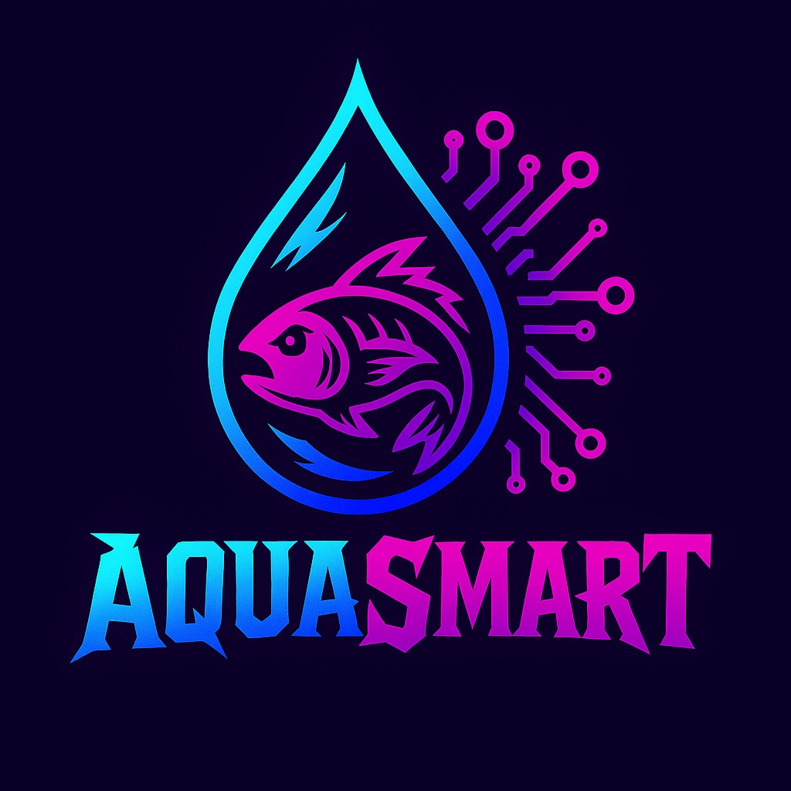

# 🌊 AquaSmart
## Deskripsi Proyek
AquaSmart adalah sistem otomatisasi berbasis Arduino Uno untuk pemberian pakan ikan dan monitoring kualitas air melalui pengukuran pH. Proyek ini bertujuan untuk mempermudah pemeliharaan akuarium atau kolam kecil dengan fitur kontrol pintar otomatis

Fitur utama:

🚿 Monitoring pH air secara real-time

🐟 Pemberian pakan otomatis berbasis timer

📱 Peringatan otomatis ke pengguna saat pH air berada di luar batas normal

🔄 Kontrol manual pemberian pakan (menggunakan push button)

## 🛠️ Komponen Perangkat Keras
Komponen | Fungsi
Arduino Uno | Otak dari sistem
Sensor pH Air | Mengukur keasaman air
Motor Servo | Mengontrol pemberian pakan
Modul Bluetooth HC-05 | Komunikasi ke perangkat via Blynk
Breadboard & Jumper | Perakitan prototipe
Power Supply | Menyediakan daya bagi sistem

## 📱 Tampilan Dashboard
Gauge untuk monitoring nilai pH

Notifikasi otomatis ketika pH tidak normal

Tombol untuk pemberian pakan manual

## 📈 Alur Sistem
Arduino membaca data sensor pH secara berkala.

Data dikirim via UART ke Blynk (melalui HC-05).

Blynk menampilkan nilai pH pada dashboard.

Jika pH <6 atau >8, sistem mengirim notifikasi peringatan berupa tampilan di LCD dan menyalanya Buzzer.

Timer internal memicu pemberian pakan secara otomatis.

Pengguna juga dapat memicu pemberian pakan manual melalui push button.

## 📊 MIND MAP BLOK DIAGRAM DAN FLOWCHART

### MIND MAP

### BLOK DIAGRAM

### FLOWCHART

