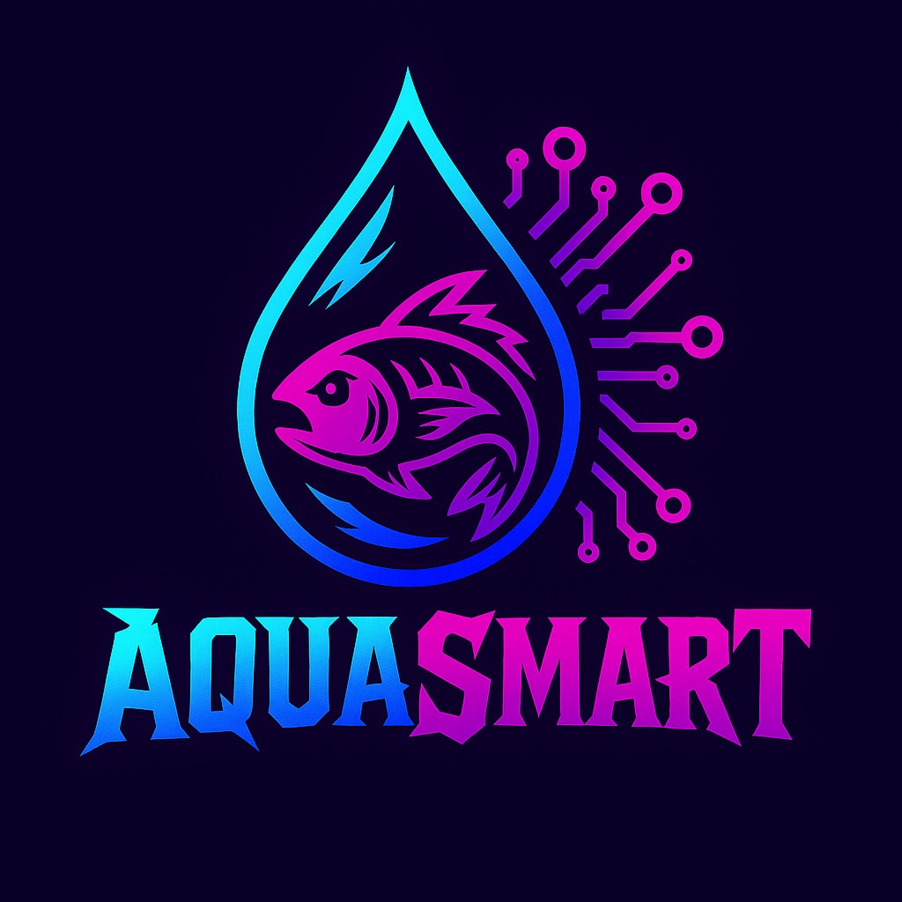
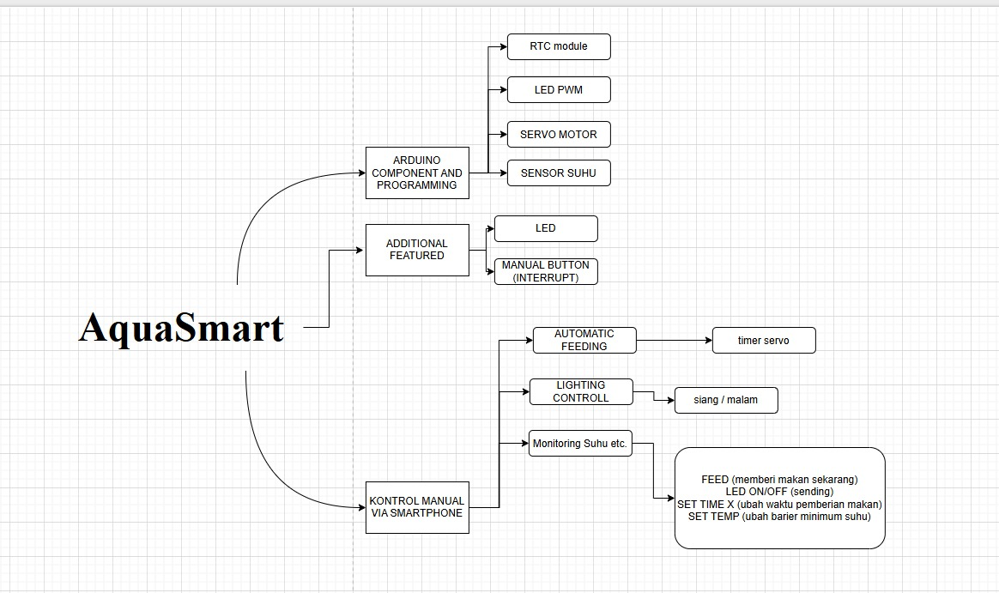
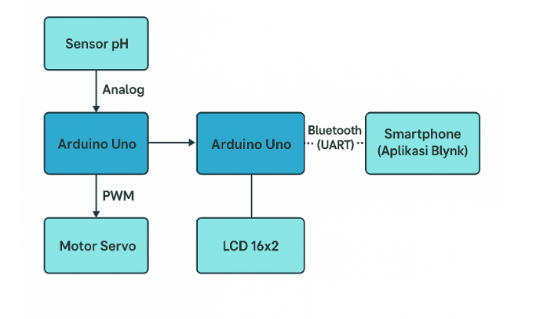

# 🌊 AquaSmart
## Deskripsi Proyek
AquaSmart adalah sistem otomatisasi berbasis Arduino Uno untuk pemberian pakan ikan dan monitoring kualitas air melalui pengukuran pH. Proyek ini bertujuan untuk mempermudah pemeliharaan akuarium atau kolam kecil dengan fitur kontrol pintar otomatis

# 🧠 ANGGOTA TEAM

|NAMA|NRP|JOBDESK|
|-----|----|------|
|Dhimas Fajar Kurniawan |2123600032| UI/UX Designer|
|Muhammad Nakhwa Zain | 2123600046 | Programmer |
|Ahmad Naufal Saifuddin | 2123600050 | Project Manager |
|Muhammad Jauhar Tsalis A. | 2123600051 | Hardware Specialist|
|Nur Cahyani | 2123600052 | Nonteknis |
|Ramatya Rimba Hamdhani | 2123600056 | 3D Designer |

## 🛠️ Fitur utama:

🚿 Monitoring pH air secara real-time

🐟 Pemberian pakan otomatis berbasis timer

📱 Peringatan otomatis ke pengguna saat pH air berada di luar batas normal

🔄 Kontrol manual pemberian pakan (menggunakan push button)

## 🛠️ Komponen Perangkat Keras
|Komponen | Fungsi |
|----------|---------|
|Arduino Uno | Otak dari sistem
|Sensor pH Air | Mengukur keasaman air
|Motor Servo | Mengontrol pemberian pakan
|LED & LCD | Indikator Perintah dijalankan |
|Breadboard & Jumper | Perakitan prototipe
|Power Supply | Menyediakan daya bagi sistem

## 📱 Tampilan Dashboard
Gauge untuk monitoring nilai pH

Notifikasi otomatis ketika pH tidak normaal

Indikasi untuk pemberian pakan manual (berjalannya perintah)

Timer untuk menunjukkan berapa waktu pemberian makan otomatis selanjutnya

## 📈 Alur Sistem
Arduino membaca data sensor pH secara berkala.

Data dikirim via UART ke Perangkat (web)

Blynk menampilkan nilai pH pada dashboard.

Jika pH >7 sistem mengirim notifikasi peringatan dan tampilan peringatan di LCD dan menyalanya Buzzer.

Timer internal memicu pemberian pakan secara otomatis.

Pengguna juga dapat memicu pemberian pakan manual melalui push button.

## 📊 MIND MAP BLOK DIAGRAM DAN FLOWCHART

### MIND MAP

### BLOK DIAGRAM

### FLOWCHART

